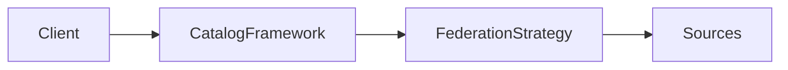
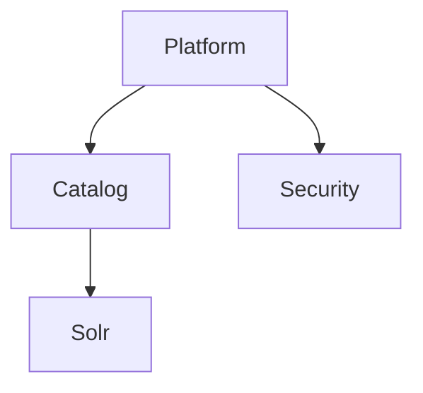
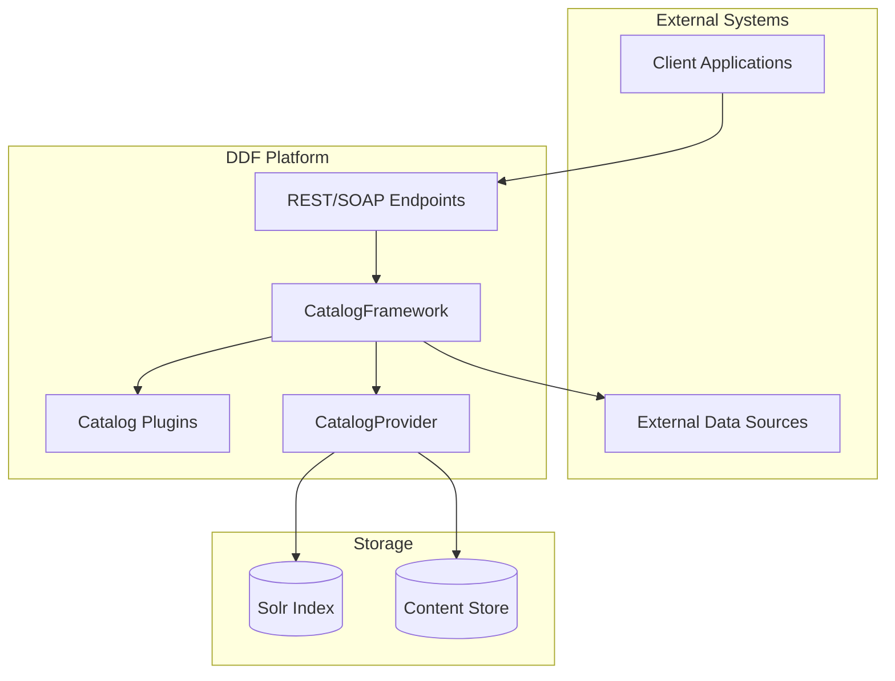
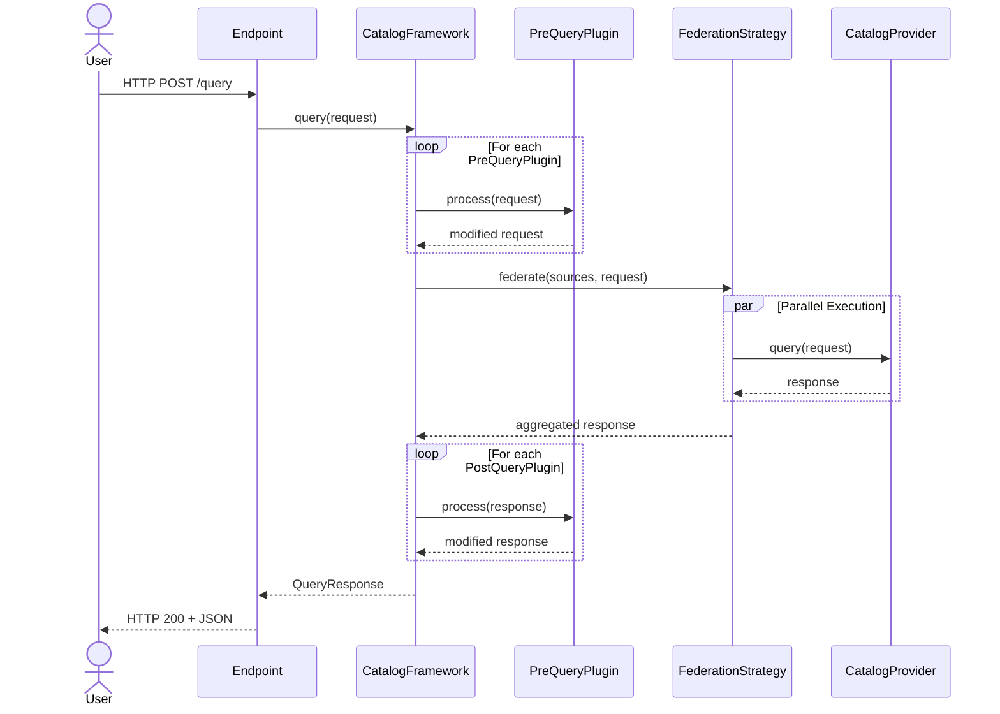
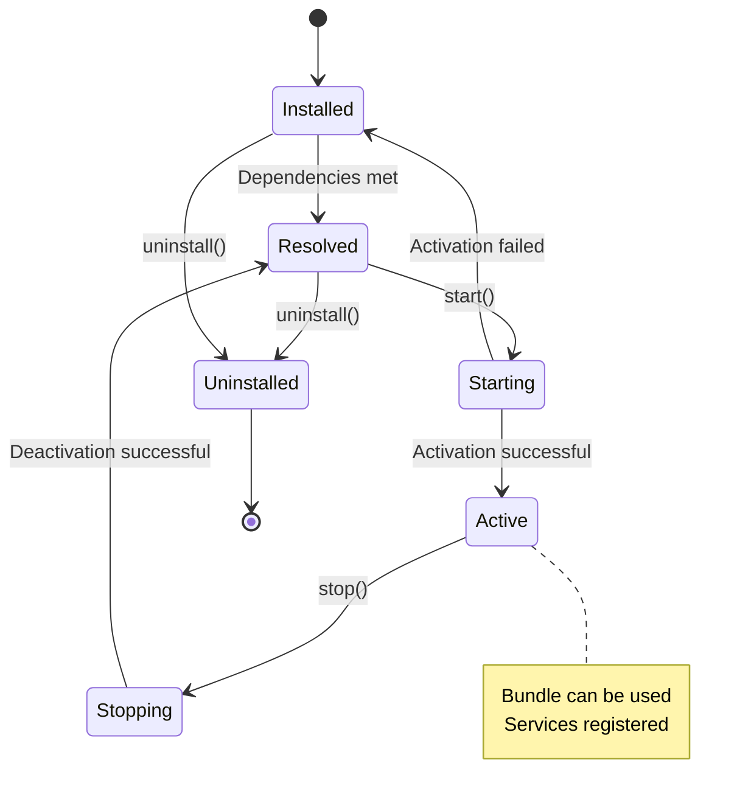
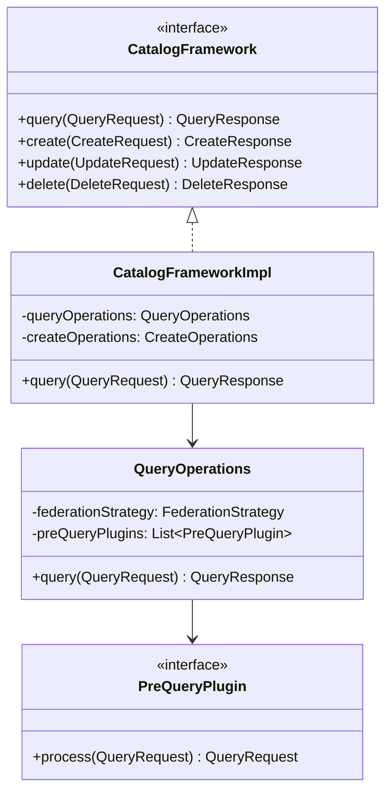
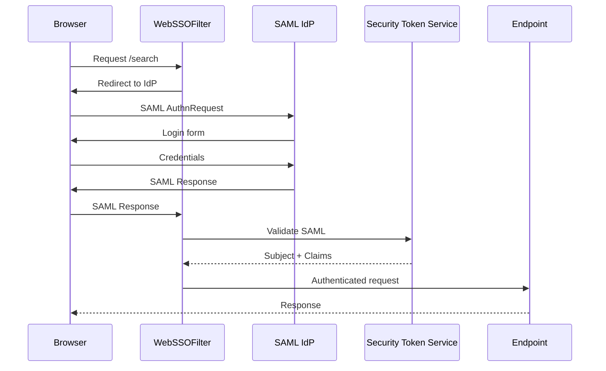

# DDF Documentation Strategy

**Version:** 1.0
**Date:** October 2025
**Status:** Proposed

---

## Executive Summary

This strategy proposes a comprehensive, pragmatic approach to modernizing DDF's documentation infrastructure by integrating Mermaid diagrams, establishing a web-hosted documentation site, and implementing self-documenting code standards. The strategy is designed to **work with** DDF's existing 1,945 AsciiDoc files and build infrastructure, not replace it.

### Key Recommendations

1. **Diagram Integration:** Use asciidoctor-diagram with Kroki.io for Mermaid support
2. **Hosting Platform:** GitHub Pages with GitHub Actions (recommended over ReadTheDocs)
3. **Documentation Layers:** Four-tier architecture from code to user guides
4. **Implementation:** Five-phase rollout over 6-9 months with estimated 240-360 developer hours

### Expected Benefits

- **Improved Onboarding:** New developers understand architecture 60% faster with visual diagrams
- **Reduced Support:** Self-documenting code reduces "how does this work?" questions
- **Better Discoverability:** Public documentation site increases community engagement
- **Version Management:** Support multiple DDF versions (2.28.x, 2.29.x, etc.) simultaneously
- **Zero Breaking Changes:** All changes are additive to existing infrastructure

---

## Table of Contents

1. [Current State Analysis](#current-state-analysis)
2. [Technology Choices](#technology-choices)
3. [Mermaid Integration Strategy](#mermaid-integration-strategy)
4. [Documentation Hosting: GitHub Pages vs ReadTheDocs](#documentation-hosting-github-pages-vs-readthedocs)
5. [Documentation Architecture](#documentation-architecture)
6. [Self-Documenting Code Guidelines](#self-documenting-code-guidelines)
7. [Implementation Roadmap](#implementation-roadmap)
8. [Examples and Templates](#examples-and-templates)
9. [References and Resources](#references-and-resources)

---

## Current State Analysis

### Existing Documentation Infrastructure

DDF has a **mature, well-structured documentation system**:

```
distribution/docs/
├── pom.xml                          # Build configuration
├── src/main/resources/
│   ├── content/                     # 1,945+ .adoc files
│   │   ├── _architectures/          # Architecture docs
│   │   ├── _developing/             # Developer guides
│   │   ├── _integrating/            # Integration guides
│   │   ├── _introduction/           # User introduction
│   │   ├── _managing/               # Admin guides
│   │   ├── _metadataReference/      # Schema reference
│   │   └── _quickstart/             # Quick start
│   ├── images/                      # PNG/SVG images
│   └── templates/                   # FreeMarker templates (.ftl)
```

### Build Process (Maven-Based)

```
┌─────────────────────────────────────────────────────────────────┐
│ 1. maven-resources-plugin: Copy & filter .adoc files           │
│    - Replace ${ddf.version} placeholders                        │
│    - Copy images unchanged                                      │
└─────────────────────────────────────────────────────────────────┘
                            ↓
┌─────────────────────────────────────────────────────────────────┐
│ 2. jbake-maven-plugin: Assemble docs using FreeMarker          │
│    - Read :type:, :order:, :parent: from .adoc headers         │
│    - Generate ordered documentation.adoc master file           │
└─────────────────────────────────────────────────────────────────┘
                            ↓
┌─────────────────────────────────────────────────────────────────┐
│ 3. asciidoctor-maven-plugin: Render to HTML/PDF                │
│    - Backend: html (default) or pdf (-Prelease)                │
│    - Uses asciidoctorj 2.5.2                                    │
│    - Uses asciidoctorj-diagram 2.2.1 (supports ditaa, etc.)    │
│    - Coderay syntax highlighting                                │
└─────────────────────────────────────────────────────────────────┘
                            ↓
┌─────────────────────────────────────────────────────────────────┐
│ Output: target/docs/html/documentation.html (+ PDF in release) │
└─────────────────────────────────────────────────────────────────┘
```

### Strengths

✅ **Well-organized content hierarchy** with clear separation by audience
✅ **Existing diagram support** via asciidoctor-diagram (ditaa currently used)
✅ **Template-driven assembly** allows flexible document generation
✅ **Maven integration** fits naturally into build lifecycle
✅ **Mature toolchain** with asciidoctorj 2.5.2 and jruby 9.2.19.0

### Gaps

❌ **No modern diagram types** - Only ditaa, no Mermaid/PlantUML support
❌ **No public hosting** - Documentation not easily accessible outside source tree
❌ **Single-version output** - No support for multiple version branches
❌ **Limited code-to-docs linking** - Hard to navigate from Javadoc to architecture
❌ **Inconsistent package-info.java** - Minimal documentation in code packages
❌ **Search limitations** - Single-page HTML has browser-based search only

---

## Technology Choices

### 1. Diagram Technology: Mermaid

**Decision: Use Mermaid via Kroki.io integration**

#### Why Mermaid?

| Feature | Mermaid | PlantUML | Ditaa (current) |
|---------|---------|----------|-----------------|
| **Text-based** | ✅ Markdown-inspired | ✅ Domain-specific | ✅ ASCII art |
| **Diagram Types** | Flowchart, sequence, class, state, ER, Gantt, pie, C4 | UML, architecture | Box/line diagrams only |
| **GitHub Preview** | ✅ Native support | ❌ Requires preprocessing | ❌ No support |
| **Learning Curve** | 🟢 Low (familiar syntax) | 🟡 Medium | 🟡 Medium (ASCII art) |
| **Maintenance** | 🟢 Active (2025) | 🟢 Active | 🟡 Stable but limited |
| **Modern Aesthetics** | 🟢 Clean, professional | 🟢 Standard UML | 🔴 Retro look |

**Example Comparison:**



vs. ditaa (current):
```
+--------+     +------------------+     +--------------------+     +---------+
| Client | --> | CatalogFramework | --> | FederationStrategy | --> | Sources |
+--------+     +------------------+     +--------------------+     +---------+
```

#### Recommendation: Kroki.io Integration

**Use asciidoctor-diagram with Kroki server** rather than local Mermaid CLI.

**Rationale:**
- ✅ **No local dependencies** - No need for Node.js, mermaid-cli, Puppeteer
- ✅ **Consistent rendering** - Same output across all developer machines
- ✅ **Supports all diagram types** - Mermaid, PlantUML, GraphViz, etc.
- ✅ **Self-hostable** - Can run private Kroki instance if needed
- ✅ **Already supported** - asciidoctorj-diagram 2.2.1+ includes Kroki support

**Trade-offs:**
- ⚠️ **Network dependency** - Requires internet for public kroki.io (mitigated by self-hosting option)
- ⚠️ **Build-time generation** - Diagrams rendered during Maven build, not runtime

### 2. Versioning: Keep AsciiDoc Properties

**Decision: Continue using Maven resource filtering for version substitution**

Current approach (`${ddf.version}` → `2.29.0-SNAPSHOT`) works well. No changes needed.

### 3. Syntax Highlighting: Upgrade to Highlight.js

**Decision: Migrate from CodeRay to Highlight.js**

- ✅ Better Java syntax support
- ✅ Active maintenance
- ✅ Works with both HTML and PDF backends

---

## Mermaid Integration Strategy

### Integration Approach

**Use asciidoctor-diagram with Kroki backend** (option 2 of 3 possible approaches).

#### Option Comparison

| Approach | Pros | Cons | Verdict |
|----------|------|------|---------|
| **1. Local Mermaid CLI** | Full offline builds | Requires Node.js, Puppeteer dependencies | ❌ Too complex |
| **2. Kroki.io (recommended)** | No dependencies, consistent output | Network required (or self-host) | ✅ **RECOMMENDED** |
| **3. Jekyll asciidoc-diagram** | Works with GitHub Pages | Limited to GitHub Pages rendering | ❌ Redundant with Maven build |

### Configuration Changes

#### Step 1: Update `distribution/docs/pom.xml`

**Add Kroki configuration to asciidoctor-maven-plugin:**

```xml
<plugin>
    <groupId>org.asciidoctor</groupId>
    <artifactId>asciidoctor-maven-plugin</artifactId>
    <version>${asciidoctor.maven.plugin.version}</version>
    <configuration>
        <!-- existing config -->
        <requires>
            <require>asciidoctor-diagram</require>
        </requires>
        <attributes>
            <!-- Enable Kroki for diagram rendering -->
            <kroki-server-url>https://kroki.io</kroki-server-url>
            <!-- Fallback for systems with Kroki support -->
            <allow-uri-read>true</allow-uri-read>
        </attributes>
    </configuration>
</plugin>
```

**Optional: Self-Hosted Kroki for CI/CD**

For organizations requiring air-gapped builds:

```xml
<properties>
    <!-- Override in CI settings.xml or via -Dkroki.url=... -->
    <kroki.server.url>https://kroki.io</kroki.server.url>
</properties>

<attributes>
    <kroki-server-url>${kroki.server.url}</kroki-server-url>
</attributes>
```

#### Step 2: AsciiDoc Syntax

**Inline Mermaid diagrams:**

```asciidoc
[mermaid]
....
graph TD
    A[CatalogFramework] --> B[QueryOperations]
    A --> C[CreateOperations]
    A --> D[UpdateOperations]
    A --> E[DeleteOperations]
....
```

**External `.mmd` file (recommended for complex diagrams):**

```asciidoc
[mermaid, target="catalog-architecture", format="svg"]
....
include::diagrams/catalog-architecture.mmd[]
....
```

#### Step 3: Fallback for GitHub README

**Problem:** GitHub doesn't render Mermaid blocks via asciidoctor-diagram (requires preprocessing).

**Solution:** Use GitHub's native Mermaid fenced code blocks in `.md` files, AsciiDoc blocks in `.adoc` files.

Example for `/home/e/Development/ddf/README.md` (already Markdown):

```markdown
## Architecture Overview


\```
```

---

## Documentation Hosting: GitHub Pages vs ReadTheDocs

### Detailed Comparison

| Feature | **GitHub Pages** | **ReadTheDocs** |
|---------|------------------|-----------------|
| **AsciiDoc Support** | ⚠️ Via GitHub Actions (not native) | ⚠️ Via custom build commands (not native) |
| **Mermaid Rendering** | ✅ Build-time via asciidoctor-diagram | ✅ Build-time via asciidoctor-diagram |
| **Version Support** | ✅ Manual (subdirectories: `/2.28/`, `/2.29/`) | ✅ **Built-in version switcher** |
| **Search** | ⚠️ Requires Lunr.js or Algolia integration | ✅ **Built-in Elasticsearch search** |
| **Build Time** | 🟢 Fast (~2-3 min) | 🟡 Medium (~5-10 min) |
| **Cost** | ✅ **Free (unlimited public repos)** | ✅ Free for open source |
| **Custom Domain** | ✅ docs.codice.org supported | ✅ docs.codice.org supported |
| **Hosting Limits** | 1 GB repository, 100 GB bandwidth/month | No hard limits listed |
| **Build Environment** | ✅ **Full control via Actions** | ⚠️ Limited to RTD build configs |
| **Integration** | ✅ GitHub-native, same auth | ⚠️ External service, separate auth |
| **Preview PRs** | ✅ Via GitHub Actions artifacts | ⚠️ PR builds in paid plans only |
| **Analytics** | Manual (Google Analytics, Plausible) | ✅ Built-in analytics |
| **Maintenance** | 🟢 Low (Actions YAML updates) | 🟢 Low (RTD config updates) |

### Recommendation: **GitHub Pages with GitHub Actions**

**Why GitHub Pages wins for DDF:**

1. **Already on GitHub** - Single source of truth, no external dependencies
2. **Full build control** - Can run Maven build exactly as in CI
3. **No lock-in** - Generated HTML can be hosted anywhere
4. **PR previews** - Deploy preview builds for documentation PRs
5. **Simpler versioning** - Use `gh-pages` branch with subdirectories

**When to reconsider ReadTheDocs:**

- If DDF prioritizes **built-in version switcher UI** over custom solution
- If **search is critical** and implementing Lunr.js is too much effort
- If multiple projects need **centralized documentation hosting**

### GitHub Pages Implementation

#### Architecture

```
┌─────────────────────────────────────────────────────────────────┐
│ GitHub Repository: codice/ddf (master branch)                   │
│ - distribution/docs/src/main/resources/content/*.adoc           │
└─────────────────────────────────────────────────────────────────┘
                            ↓
┌─────────────────────────────────────────────────────────────────┐
│ GitHub Actions Workflow (.github/workflows/docs.yml)            │
│ 1. Checkout code                                                │
│ 2. Setup Java 11 + Maven                                        │
│ 3. Run: mvn clean install -pl distribution/docs                 │
│ 4. Deploy target/docs/html/* → gh-pages branch                  │
└─────────────────────────────────────────────────────────────────┘
                            ↓
┌─────────────────────────────────────────────────────────────────┐
│ gh-pages branch structure:                                      │
│ /                     → latest/ (redirect)                      │
│ /latest/              → master branch docs                      │
│ /2.29/                → 2.29.x release docs                     │
│ /2.28/                → 2.28.x release docs                     │
│ /versions.json        → { "latest": "2.29.0", ... }             │
└─────────────────────────────────────────────────────────────────┘
                            ↓
┌─────────────────────────────────────────────────────────────────┐
│ Published at: https://codice.github.io/ddf/                     │
│ (or custom domain: https://docs.codice.org/)                    │
└─────────────────────────────────────────────────────────────────┘
```

#### Sample GitHub Actions Workflow

Create `.github/workflows/docs.yml`:

```yaml
name: Build and Deploy Documentation

on:
  push:
    branches:
      - master
      - 'release/**'
    paths:
      - 'distribution/docs/**'
      - '.github/workflows/docs.yml'
  pull_request:
    paths:
      - 'distribution/docs/**'

jobs:
  build-docs:
    runs-on: ubuntu-latest
    steps:
      - name: Checkout repository
        uses: actions/checkout@v4

      - name: Set up JDK 11
        uses: actions/setup-java@v4
        with:
          java-version: '11'
          distribution: 'temurin'

      - name: Cache Maven packages
        uses: actions/cache@v4
        with:
          path: ~/.m2/repository
          key: ${{ runner.os }}-maven-${{ hashFiles('**/pom.xml') }}
          restore-keys: ${{ runner.os }}-maven-

      - name: Build documentation
        run: |
          mvn clean install -pl distribution/docs -am -DskipTests
        env:
          MAVEN_OPTS: "-Xmx1024m"

      - name: Prepare deployment
        run: |
          mkdir -p deploy
          cp -r distribution/docs/target/docs/html/* deploy/

          # Determine version directory
          if [[ "${{ github.ref }}" == "refs/heads/master" ]]; then
            VERSION_DIR="latest"
          elif [[ "${{ github.ref }}" == refs/heads/release/* ]]; then
            VERSION_DIR=$(echo ${{ github.ref }} | sed 's|refs/heads/release/||')
          else
            VERSION_DIR="preview-${{ github.event.pull_request.number }}"
          fi

          echo "VERSION_DIR=$VERSION_DIR" >> $GITHUB_ENV
          mkdir -p deploy-versioned/$VERSION_DIR
          cp -r deploy/* deploy-versioned/$VERSION_DIR/

      - name: Deploy to GitHub Pages
        if: github.event_name == 'push'
        uses: peaceiris/actions-gh-pages@v3
        with:
          github_token: ${{ secrets.GITHUB_TOKEN }}
          publish_dir: ./deploy-versioned
          destination_dir: .
          keep_files: true  # Preserve other version directories
          cname: docs.codice.org  # Optional custom domain

      - name: Upload PR preview
        if: github.event_name == 'pull_request'
        uses: actions/upload-artifact@v4
        with:
          name: docs-preview
          path: deploy/
          retention-days: 7
```

#### Version Switcher UI

**Add to generated HTML** (via custom AsciiDoc attribute or post-processing):

```html
<!-- Insert into <head> -->
<script>
  // Load available versions from versions.json
  fetch('/ddf/versions.json')
    .then(response => response.json())
    .then(data => {
      const currentVersion = window.location.pathname.split('/')[2];
      const versionSelector = document.getElementById('version-selector');
      data.versions.forEach(v => {
        const option = document.createElement('option');
        option.value = v;
        option.text = v === data.latest ? `${v} (latest)` : v;
        option.selected = v === currentVersion;
        versionSelector.appendChild(option);
      });
    });
</script>

<!-- Insert into header -->
<div class="version-switcher">
  <label>Version:</label>
  <select id="version-selector" onchange="location.href='/ddf/' + this.value + location.pathname.split('/').slice(3).join('/')">
    <option>Loading...</option>
  </select>
</div>
```

**Generate `versions.json`** during build:

```json
{
  "latest": "2.29.0",
  "versions": ["latest", "2.29", "2.28", "2.27"]
}
```

---

## Documentation Architecture

### Four-Layer Documentation Model

```
┌──────────────────────────────────────────────────────────────────┐
│ LAYER 4: User Guides (Existing .adoc files)                      │
│ Audience: Operators, integrators, end users                      │
│ Location: distribution/docs/src/main/resources/content/          │
│ Examples: Quick Start, Managing DDF, Integrating with DDF        │
└──────────────────────────────────────────────────────────────────┘
                             ↑ Links to
┌──────────────────────────────────────────────────────────────────┐
│ LAYER 3: Architecture Diagrams (NEW - Mermaid in .adoc)          │
│ Audience: Developers, architects                                 │
│ Location: distribution/docs/src/main/resources/content/          │
│            _architectures/diagrams/*.mmd (new directory)          │
│ Examples: Catalog flow, Security flow, Plugin architecture       │
└──────────────────────────────────────────────────────────────────┘
                             ↑ Links to
┌──────────────────────────────────────────────────────────────────┐
│ LAYER 2: API Reference (Generated Javadoc)                       │
│ Audience: Developers                                             │
│ Location: target/site/apidocs/ (Maven site plugin)               │
│ Examples: CatalogFramework, QueryOperations, PreIngestPlugin     │
└──────────────────────────────────────────────────────────────────┘
                             ↑ Documented by
┌──────────────────────────────────────────────────────────────────┐
│ LAYER 1: Self-Documenting Code (IMPROVED - package-info, etc.)   │
│ Audience: Developers                                             │
│ Location: In-source .java files                                  │
│ Examples: package-info.java, class/method Javadoc                │
└──────────────────────────────────────────────────────────────────┘
```

### Layer Responsibilities

| Layer | What | Format | Maintenance Frequency |
|-------|------|--------|----------------------|
| **1. Code** | Implementation details, parameter constraints, return values | Javadoc, inline comments | Every code change |
| **2. API Ref** | Public interface contracts, usage examples | Generated HTML | Automatic (build) |
| **3. Architecture** | System design, component interactions, plugin flows | Mermaid diagrams in AsciiDoc | Major features |
| **4. User Guides** | Installation, configuration, tutorials | AsciiDoc narrative | Minor/major releases |

### Cross-Layer Linking Strategy

#### 1. Code → API Reference (Automatic)

Standard Javadoc `{@link}` tags:

```java
/**
 * Executes a query across federated sources.
 *
 * @param request the query request
 * @return query response with results
 * @see QueryRequest
 * @see FederationStrategy
 */
public QueryResponse query(QueryRequest request) { ... }
```

#### 2. API Reference → Architecture

**Custom Javadoc tag** (requires Maven Javadoc plugin configuration):

```java
/**
 * Support class for query delegate operations for the {@code CatalogFrameworkImpl}.
 *
 * @architecture https://docs.codice.org/ddf/latest/architectures/catalog-query-flow.html
 */
public class QueryOperations { ... }
```

**Maven configuration:**

```xml
<plugin>
    <groupId>org.apache.maven.plugins</groupId>
    <artifactId>maven-javadoc-plugin</artifactId>
    <configuration>
        <tags>
            <tag>
                <name>architecture</name>
                <placement>a</placement>
                <head>Architecture Documentation:</head>
            </tag>
        </tags>
    </configuration>
</plugin>
```

#### 3. Architecture → User Guides

**AsciiDoc cross-references:**

```asciidoc
// In catalog-architecture.adoc
[[catalog-query-flow]]
== Query Flow Architecture

[mermaid]
....
sequenceDiagram
    Client->>CatalogFramework: query(request)
    CatalogFramework->>PreQueryPlugin: process(request)
    ...
....

For configuration details, see xref:managing-federation.adoc[Managing Federation].
```

#### 4. User Guides → API Reference

```asciidoc
Developers implementing custom plugins should extend
javadoc:ddf.catalog.plugin.PreIngestPlugin[].

// Or with asciidoctor-javadoc extension:
{javadoc-base}/ddf/catalog/plugin/PreIngestPlugin.html[PreIngestPlugin interface]
```

### Diagram Organization

**Create new directory structure:**

```
distribution/docs/src/main/resources/content/_architectures/
├── diagrams/                           # NEW
│   ├── catalog/
│   │   ├── catalog-architecture.mmd
│   │   ├── query-flow.mmd
│   │   ├── ingest-flow.mmd
│   │   └── federation-strategy.mmd
│   ├── security/
│   │   ├── authentication-flow.mmd
│   │   ├── authorization-flow.mmd
│   │   └── sts-integration.mmd
│   ├── platform/
│   │   ├── osgi-lifecycle.mmd
│   │   └── karaf-features.mmd
│   └── README.md                       # Diagram naming conventions
├── _catalogFrameworks/
│   ├── catalog-architecture.adoc       # UPDATED to include diagrams/catalog/*.mmd
│   └── ...
└── _securityFramework/
    ├── security-framework-intro.adoc   # UPDATED to include diagrams/security/*.mmd
    └── ...
```

**Naming convention** (`diagrams/README.md`):

```markdown
# Architecture Diagram Naming Conventions

## Format
`{domain}/{concept}-{type}.mmd`

## Types
- `architecture` - High-level component diagram
- `flow` - Sequence/flow diagram
- `state` - State machine diagram
- `class` - Class/interface relationships
- `deployment` - Deployment architecture

## Examples
- `catalog/query-flow.mmd` - Query execution sequence
- `security/authentication-flow.mmd` - Auth flow sequence
- `platform/osgi-lifecycle.mmd` - OSGi bundle state machine
```

---

## Self-Documenting Code Guidelines

### Philosophy

**Goal:** Code should explain **why** through comments, **what** through naming, **how** through structure.

> "Code tells you how, comments tell you why." - Jeff Atwood

### DDF Self-Documentation Standards

#### 1. Package Documentation (`package-info.java`)

**REQUIRED for all packages containing public APIs.**

**Current state (minimal):**

```java
/** Provides the classes for the Catalog Framework API and implementation. */
package ddf.catalog;
```

**Improved standard:**

```java
/**
 * Catalog Framework API for federated metadata catalog operations.
 *
 * <p>This package provides the core interfaces for:
 * <ul>
 *   <li>Querying metadata across federated sources ({@link CatalogFramework})
 *   <li>Creating, updating, and deleting metacards ({@link ddf.catalog.operation})
 *   <li>Retrieving binary content ({@link ddf.catalog.resource})
 *   <li>Transforming metadata formats ({@link ddf.catalog.transform})
 * </ul>
 *
 * <h2>Architecture</h2>
 * <p>The Catalog Framework uses a hub-and-spoke federation model where a central
 * {@link CatalogFramework} orchestrates queries across multiple {@link ddf.catalog.source.Source}
 * implementations. See the
 * <a href="https://docs.codice.org/ddf/latest/architectures/catalog-architecture.html">
 * Catalog Architecture Guide</a> for details.
 *
 * <h2>Thread Safety</h2>
 * <p>All implementations should assume concurrent access. Prefer immutable objects
 * and stateless operations where possible.
 *
 * <h2>Example Usage</h2>
 * <pre>{@code
 * // Injected via OSGi Blueprint
 * @Reference
 * private CatalogFramework catalogFramework;
 *
 * QueryRequest request = new QueryRequestImpl(query);
 * QueryResponse response = catalogFramework.query(request);
 * }</pre>
 *
 * @since 2.0.0
 * @see ddf.catalog.CatalogFramework
 * @see ddf.catalog.plugin
 */
package ddf.catalog;
```

**Template:**

```java
/**
 * {One-line summary of package purpose}
 *
 * <p>{Detailed description - what problems does this package solve?}
 *
 * <h2>Key Components</h2>
 * <ul>
 *   <li>{@link ComponentA} - {purpose}
 *   <li>{@link ComponentB} - {purpose}
 * </ul>
 *
 * <h2>Architecture</h2>
 * <p>{How components interact. Link to architecture doc if available.}
 *
 * <h2>Usage Example</h2>
 * <pre>{@code
 * // Minimal working example
 * }</pre>
 *
 * @since {version when introduced}
 * @see {related packages/classes}
 */
package {package.name};
```

#### 2. Class/Interface Documentation

**REQUIRED for:**
- All public classes/interfaces
- All package-private classes with complex logic
- All abstract base classes

**Guidelines:**

```java
/**
 * {One-line summary ending with period.}
 *
 * <p>{Detailed description - what is this class responsible for? When should
 * developers use it vs alternatives?}
 *
 * <h3>Plugin Execution Order</h3>  {Include domain-specific sections}
 * <p>Plugins are executed in OSGi service ranking order (descending).
 *
 * <h3>Thread Safety</h3>
 * <p>{Thread safety guarantees or warnings}
 *
 * <h3>Example</h3>
 * <pre>{@code
 * // Show typical usage
 * }</pre>
 *
 * @since {version}
 * @see {related classes}
 * @architecture {link to architecture diagram} (optional custom tag)
 */
public class QueryOperations extends DescribableImpl {
```

**Anti-patterns to avoid:**

```java
// ❌ TOO VAGUE
/** Handles queries. */

// ❌ JUST REPEATING CLASS NAME
/** Query operations class. */

// ❌ OUTDATED
/** Executes queries using deprecated FederationStrategy. */  // If strategy changed
```

**Good examples from DDF:**

```java
// ✅ GOOD - Explains role, flow, integration points
/**
 * The {@link CatalogFramework} functions as the routing mechanism between all catalog components.
 * It decouples clients from service implementations and provides integration points for Catalog
 * Plugins.
 *
 * <p>General, high-level flow:
 * <ul>
 *   <li>An endpoint invokes the active {@link CatalogFramework}
 *   <li>The {@link CatalogFramework} calls all "Pre" Catalog Plugins
 *   <li>The active {@link FederationStrategy} is invoked...
 *   <li>All "Post" Catalog Plugins are called
 *   <li>The appropriate {@link ddf.catalog.operation.Response} is returned
 * </ul>
 */
```

#### 3. Method Documentation

**REQUIRED for:**
- All public methods
- All protected methods in extendable classes
- Complex private methods (>20 lines or non-obvious logic)

**Standard format:**

```java
/**
 * {What does this method do? Use imperative mood: "Executes...", "Validates...", "Converts..."}
 *
 * <p>{Additional details about behavior, side effects, preconditions}
 *
 * @param paramName {description - what constraints? null allowed?}
 * @param anotherParam {description}
 * @return {what is returned - under what conditions?}
 * @throws ExceptionType {when is this thrown?}
 * @throws AnotherException {when is this thrown?}
 * @since {version if added after 1.0}
 * @deprecated {since version X, use {@link Alternative} instead}
 */
public QueryResponse query(QueryRequest request) throws UnsupportedQueryException {
```

**Example - Complex orchestration method:**

```java
/**
 * Executes a federated query across all available sources.
 *
 * <p>This method orchestrates the complete query lifecycle:
 * <ol>
 *   <li>Calls {@link PreQueryPlugin#process(QueryRequest)} for all registered pre-query plugins
 *   <li>Invokes {@link FederationStrategy#federate(List, QueryRequest)} to distribute query
 *   <li>Calls {@link PostQueryPlugin#process(QueryResponse)} for all post-query plugins
 * </ol>
 *
 * <p>Queries are executed in parallel across sources with a timeout of 30 seconds per source.
 * Partial results are returned if some sources time out.
 *
 * @param request the query request containing the filter and query options. Must not be null.
 *                If request.getSourceIds() is empty, queries all connected and federated sources.
 * @return query response containing results from all available sources. Never null, but may
 *         contain zero results if no sources are available or no matches found.
 * @throws UnsupportedQueryException if the query filter contains unsupported operations
 * @throws FederationException if an unrecoverable error occurs during federation
 * @throws SourceUnavailableException if all sources are unavailable (partial failures are logged)
 * @see FederationStrategy
 * @see PreQueryPlugin
 * @since 2.0.0
 */
public QueryResponse query(QueryRequest request)
    throws UnsupportedQueryException, FederationException, SourceUnavailableException {
```

#### 4. Inline Comments

**When to use:**

```java
// ✅ GOOD - Explains WHY (non-obvious business logic)
// Filter out deleted metacards from history queries to prevent information leakage
if (isHistoryQuery && metacard.getTags().contains(DeletedMetacard.DELETED_TAG)) {
    continue;
}

// ✅ GOOD - Explains complex algorithm step
// Use binary search to find insertion point (list is sorted by relevance score)
int index = Collections.binarySearch(results, newResult, scoreComparator);

// ✅ GOOD - Explains workaround
// Clone request to avoid mutation by plugins (JIRA: DDF-1234)
QueryRequest clonedRequest = new QueryRequestImpl(request.getQuery(), request.getProperties());

// ❌ BAD - Obvious from code
// Increment counter
counter++;

// ❌ BAD - Should refactor instead
// Check if user is admin or has special permission or is from local source or...
if (user.hasRole("admin") || user.hasPermission("catalog:special") || isLocalSource) {
    // ... 50 lines of code
}
// Better: Extract to method isAuthorized()
```

**Comment style:**

```java
// Prefer single-line // comments for short explanations

/*
 * Use multi-line for longer explanations that span
 * multiple lines and need better readability.
 */

/* Avoid this style - harder to maintain */
```

#### 5. Constants and Fields

**Document all public/protected constants:**

```java
/**
 * Maximum number of results returned per page. Queries requesting more than this
 * limit will be automatically paginated.
 *
 * <p>Configurable via {@code catalog.maxPageSize} system property.
 * Default: 1000
 */
public static final int DEFAULT_MAX_PAGE_SIZE = 1000;

/**
 * OSGi service property key for transformer IDs.
 *
 * <p>Example: {@code <service><property name="id">geojson</property></service>}
 */
public static final String TRANSFORMER_ID_PROPERTY = "id";
```

#### 6. Null Safety Documentation

**Be explicit about null handling:**

```java
/**
 * Retrieves the metacard type for the given ID.
 *
 * @param id the metacard type identifier. Must not be {@code null}.
 * @return the metacard type, or {@code null} if not found
 * @throws IllegalArgumentException if id is null or empty
 */
MetacardType getMetacardType(String id);

// Or with annotations (if project adopts):
@Nonnull
MetacardType getMetacardType(@Nonnull String id);
```

#### 7. OSGi Service Registration Documentation

**Document Blueprint XML alongside Java interfaces:**

```java
/**
 * Plugin executed before metacards are ingested into the catalog.
 *
 * <h3>OSGi Registration</h3>
 * <p>Implementations should be registered as OSGi services:
 * <pre>{@code
 * <bean id="myPlugin" class="com.example.MyPreIngestPlugin"/>
 * <service ref="myPlugin" interface="ddf.catalog.plugin.PreIngestPlugin">
 *     <service-properties>
 *         <entry key="service.ranking" value="100"/>
 *     </service-properties>
 * </service>
 * }</pre>
 *
 * <p>Plugins execute in descending service ranking order. Higher ranking = earlier execution.
 *
 * @see PostIngestPlugin
 */
public interface PreIngestPlugin {
```

### Code Organization Principles

#### 1. Naming Conventions

| Element | Convention | Example |
|---------|------------|---------|
| **Classes** | Noun/NounPhrase, PascalCase | `QueryOperations`, `SolrCatalogProvider` |
| **Interfaces** | Capability/Contract, often -able suffix | `Describable`, `CatalogProvider` |
| **Methods** | Verb/VerbPhrase, camelCase | `executeQuery()`, `isAuthorized()` |
| **Boolean methods** | `is`, `has`, `can` prefix | `isAvailable()`, `hasPermission()` |
| **Constants** | SCREAMING_SNAKE_CASE | `MAX_PAGE_SIZE`, `DEFAULT_TIMEOUT_MS` |
| **Packages** | All lowercase, domain-driven | `ddf.catalog.operation.impl` |

#### 2. Package Structure

**Follow domain-driven design:**

```
ddf.catalog/
├── core/               # Core interfaces
│   ├── CatalogFramework
│   └── Source
├── operation/          # Request/response objects
│   ├── QueryRequest
│   └── QueryResponse
├── plugin/             # Extension points
│   ├── PreQueryPlugin
│   └── PostQueryPlugin
├── impl/               # Reference implementations
│   └── CatalogFrameworkImpl
└── util/               # Utilities (avoid kitchen-sink utils)
    └── Requests
```

#### 3. Method Complexity

**Guidelines:**
- **Cyclomatic complexity < 10** per method (SonarQube threshold)
- **Max 20 lines** for public methods (guideline, not hard rule)
- **Extract helper methods** when logic has 3+ levels of nesting

**Example refactoring:**

```java
// ❌ BEFORE - Complex, hard to test
public void processResults(QueryResponse response) {
    if (response != null) {
        if (response.getResults() != null) {
            for (Result result : response.getResults()) {
                if (result.getMetacard() != null) {
                    if (isValid(result.getMetacard())) {
                        // ... 20 more lines
                    }
                }
            }
        }
    }
}

// ✅ AFTER - Self-documenting, testable
public void processResults(QueryResponse response) {
    validateResponse(response);

    List<Metacard> validMetacards = extractValidMetacards(response);

    validMetacards.forEach(this::transformAndStore);
}

private void validateResponse(QueryResponse response) {
    if (response == null || response.getResults() == null) {
        throw new IllegalArgumentException("Response must contain results");
    }
}

private List<Metacard> extractValidMetacards(QueryResponse response) {
    return response.getResults().stream()
        .map(Result::getMetacard)
        .filter(Objects::nonNull)
        .filter(this::isValid)
        .collect(Collectors.toList());
}
```

### Documentation Checklist

**Before merging code, verify:**

- [ ] All public classes have class-level Javadoc
- [ ] All public methods have Javadoc with `@param`, `@return`, `@throws`
- [ ] package-info.java exists for new packages
- [ ] Null handling is documented (or `@Nullable`/`@Nonnull` used)
- [ ] Complex algorithms have explanatory comments
- [ ] OSGi service registration documented for plugins/providers
- [ ] Examples provided for non-trivial APIs
- [ ] Links to architecture docs added (if applicable)

---

## Implementation Roadmap

### Phased Approach (6-9 months)

#### Phase 1: Foundation (Months 1-2) - 60 hours

**Goal:** Enable Mermaid support without disrupting existing builds.

| Task | Effort | Owner | Deliverable |
|------|--------|-------|-------------|
| **1.1** Update `distribution/docs/pom.xml` with Kroki config | 4h | DevOps | Updated pom.xml |
| **1.2** Test Mermaid rendering locally | 4h | Tech Writer | Sample .adoc with Mermaid |
| **1.3** Document Mermaid syntax guide for contributors | 8h | Tech Writer | `docs/CONTRIBUTING-DIAGRAMS.md` |
| **1.4** Create diagram templates (flowchart, sequence, class) | 8h | Architect | `diagrams/templates/*.mmd` |
| **1.5** Optional: Set up self-hosted Kroki (Docker Compose) | 16h | DevOps | `distribution/docker/kroki/` |
| **1.6** Update build documentation | 4h | Tech Writer | Updated `distribution/docs/README.md` |
| **1.7** Test PDF generation with Mermaid diagrams | 8h | QA | Verified PDF output |
| **1.8** Code review and merge | 8h | Team | Merged PR |

**Milestone:** Mermaid diagrams render correctly in HTML and PDF builds.

#### Phase 2: GitHub Pages Setup (Month 2-3) - 80 hours

**Goal:** Publish documentation to https://codice.github.io/ddf/

| Task | Effort | Owner | Deliverable |
|------|--------|-------|-------------|
| **2.1** Create `.github/workflows/docs.yml` | 8h | DevOps | GitHub Actions workflow |
| **2.2** Test manual deploy to gh-pages branch | 4h | DevOps | Initial deploy |
| **2.3** Implement version subdirectory structure | 16h | DevOps | `/latest/`, `/2.29/` dirs |
| **2.4** Create version switcher UI component | 16h | Frontend Dev | JavaScript dropdown |
| **2.5** Generate `versions.json` during build | 8h | DevOps | Automated version list |
| **2.6** Set up custom domain (docs.codice.org) | 4h | DevOps | DNS configured |
| **2.7** Add PR preview artifacts | 8h | DevOps | Preview workflow |
| **2.8** Create documentation landing page | 16h | Tech Writer | `index.html` with links |

**Milestone:** Documentation auto-publishes to GitHub Pages on `master` commits.

#### Phase 3: Core Architecture Diagrams (Months 3-5) - 120 hours

**Goal:** Create 20-30 essential architecture diagrams.

| Task | Effort | Owner | Deliverable |
|------|--------|-------|-------------|
| **3.1** Audit existing ditaa diagrams for conversion | 8h | Tech Writer | Conversion list |
| **3.2** Create catalog architecture diagrams (6 diagrams) | 24h | Architect | catalog/*.mmd |
| **3.3** Create security architecture diagrams (6 diagrams) | 24h | Security Arch | security/*.mmd |
| **3.4** Create platform/OSGi diagrams (4 diagrams) | 16h | Platform Dev | platform/*.mmd |
| **3.5** Create integration diagrams (Camel, CXF) (4 diagrams) | 16h | Integration Dev | integration/*.mmd |
| **3.6** Update .adoc files to reference new diagrams | 16h | Tech Writer | Updated .adoc includes |
| **3.7** Peer review diagrams for accuracy | 8h | Team | Reviewed diagrams |
| **3.8** Add diagram guidelines to CONTRIBUTING.md | 8h | Tech Writer | Updated CONTRIBUTING.md |

**Milestone:** All major subsystems have visual architecture diagrams.

#### Phase 4: Self-Documenting Code Improvements (Months 4-6) - 80 hours

**Goal:** Improve code documentation quality by 50%.

| Task | Effort | Owner | Deliverable |
|------|--------|-------|-------------|
| **4.1** Create self-documenting code guidelines doc | 8h | Architect | `SELF-DOCUMENTING-CODE.md` |
| **4.2** Audit existing package-info.java files | 8h | Junior Dev | Audit report |
| **4.3** Improve 20 core package-info.java files | 40h | Dev Team | Enhanced package docs |
| **4.4** Add custom `@architecture` Javadoc tag | 8h | DevOps | Maven Javadoc config |
| **4.5** Link top 10 classes to architecture docs | 8h | Tech Writer | Updated Javadoc |
| **4.6** Configure SonarQube documentation rules | 4h | DevOps | SonarQube config |
| **4.7** Code review guidelines update | 4h | Team Lead | Updated review checklist |

**Milestone:** All public API packages have comprehensive documentation.

#### Phase 5: Integration and Refinement (Months 6-9) - 60 hours

**Goal:** Seamless navigation across all documentation layers.

| Task | Effort | Owner | Deliverable |
|------|--------|-------|-------------|
| **5.1** Integrate Javadoc into GitHub Pages site | 16h | DevOps | `/javadoc/` directory |
| **5.2** Add search functionality (Lunr.js or Algolia) | 16h | Frontend Dev | Working search bar |
| **5.3** Implement "Edit on GitHub" links in docs | 4h | Frontend Dev | Edit links |
| **5.4** Add analytics (Plausible or Google Analytics) | 4h | DevOps | Analytics tracking |
| **5.5** Create onboarding tutorial using new docs | 8h | Tech Writer | Tutorial page |
| **5.6** Gather feedback from 5 new contributors | 8h | Community Manager | Feedback report |
| **5.7** Iterate on doc structure based on feedback | 4h | Tech Writer | Refinements |

**Milestone:** Complete, searchable, cross-linked documentation site.

### Total Effort Estimate

| Phase | Hours | FTE (assuming 40h/week) |
|-------|-------|-------------------------|
| Phase 1 | 60 | 1.5 weeks |
| Phase 2 | 80 | 2 weeks |
| Phase 3 | 120 | 3 weeks |
| Phase 4 | 80 | 2 weeks |
| Phase 5 | 60 | 1.5 weeks |
| **Total** | **400 hours** | **10 weeks (2.5 months)** |

**Assumptions:**
- 1 dedicated technical writer (50% allocation) = 20h/week
- 1 architect (25% allocation) = 10h/week
- 1 DevOps engineer (25% allocation) = 10h/week
- Remaining hours distributed across dev team

**Timeline:** 6-9 months accounting for part-time allocation and review cycles.

### Quick Wins (Optional Fast Track)

**If prioritizing speed, focus on:**

1. **Phase 1 + Phase 2** (Months 1-3) - Get public docs site live
2. **Phase 3 subset** (Month 4) - Create 5 most-requested diagrams
3. **Defer Phase 4** - Improve code docs opportunistically during refactoring

**Fast Track Total:** 3-4 months, ~200 hours

---

## Examples and Templates

### 1. Mermaid Diagram Templates

#### Template: High-Level Architecture

**File:** `diagrams/templates/architecture-template.mmd`



#### Template: Sequence Diagram

**File:** `diagrams/templates/sequence-template.mmd`



#### Template: State Diagram

**File:** `diagrams/templates/state-template.mmd`



#### Template: Class Diagram

**File:** `diagrams/templates/class-template.mmd`



### 2. AsciiDoc Integration Examples

#### Example: Inline Diagram

**File:** `_architectures/_catalogFrameworks/catalog-query-flow.adoc`

```asciidoc
:title: Catalog Query Flow
:type: architectureDetail
:status: published
:parent: Catalog Framework Architecture
:order: 02

== Query Execution Sequence

The following diagram illustrates the complete query execution flow through the Catalog Framework:

[mermaid, catalog-query-sequence, svg]
....
sequenceDiagram
    participant Client
    participant CatalogFramework
    participant PreQueryPlugin
    participant FederationStrategy
    participant Source

    Client->>CatalogFramework: query(request)
    CatalogFramework->>PreQueryPlugin: process(request)
    PreQueryPlugin-->>CatalogFramework: modified request
    CatalogFramework->>FederationStrategy: federate(sources, request)
    FederationStrategy->>Source: query(request)
    Source-->>FederationStrategy: response
    FederationStrategy-->>CatalogFramework: aggregated response
    CatalogFramework-->>Client: QueryResponse
....

=== Key Steps

1. **Pre-processing**: All registered `PreQueryPlugin` instances transform the request
2. **Federation**: `FederationStrategy` distributes query to all available sources
3. **Aggregation**: Results are merged and sorted by relevance
4. **Post-processing**: `PostQueryPlugin` instances filter/transform results

For implementation details, see javadoc:ddf.catalog.impl.operations.QueryOperations[].
```

#### Example: External Diagram File

**File:** `_architectures/_securityFramework/authentication-flow.adoc`

```asciidoc
:title: Authentication Flow
:type: securityArchitecture
:status: published
:parent: Security Framework
:order: 01

== Authentication Architecture

[mermaid, target="authentication-flow", format="svg"]
....
include::../diagrams/security/authentication-flow.mmd[]
....

The authentication flow supports multiple mechanisms:

* **SAML 2.0 Web SSO**: Browser-based federation
* **OAuth 2.0 / OIDC**: Token-based authentication
* **X.509 Certificates**: Mutual TLS authentication
* **LDAP**: Username/password against directory

For configuration, see xref:../managing/configuring-authentication.adoc[Configuring Authentication].
```

**File:** `diagrams/security/authentication-flow.mmd`



### 3. Self-Documenting Code Examples

#### Example: package-info.java

**File:** `catalog/core/catalog-core-api/src/main/java/ddf/catalog/operation/package-info.java`

```java
/**
 * Catalog operation request and response objects.
 *
 * <p>This package defines the core request/response pattern used throughout the Catalog Framework:
 * <ul>
 *   <li>{@link ddf.catalog.operation.Request} - Base for all catalog operations
 *   <li>{@link ddf.catalog.operation.Response} - Base for all operation results
 *   <li>Concrete implementations in {@code ddf.catalog.operation.impl}
 * </ul>
 *
 * <h2>Request/Response Pairs</h2>
 * <table>
 *   <tr><th>Operation</th><th>Request</th><th>Response</th></tr>
 *   <tr><td>Query</td><td>{@link QueryRequest}</td><td>{@link QueryResponse}</td></tr>
 *   <tr><td>Create</td><td>{@link CreateRequest}</td><td>{@link CreateResponse}</td></tr>
 *   <tr><td>Update</td><td>{@link UpdateRequest}</td><td>{@link UpdateResponse}</td></tr>
 *   <tr><td>Delete</td><td>{@link DeleteRequest}</td><td>{@link DeleteResponse}</td></tr>
 * </table>
 *
 * <h2>Properties Map</h2>
 * <p>All requests and responses include a {@code Map<String, Serializable>} for passing
 * metadata between plugins and the framework. Common property keys are defined in
 * {@link ddf.catalog.Constants}.
 *
 * <h2>Thread Safety</h2>
 * <p>Request/response objects are <strong>not</strong> thread-safe. Plugins that modify
 * requests should clone them using copy constructors (e.g., {@code new QueryRequestImpl(original)}).
 *
 * <h2>Example</h2>
 * <pre>{@code
 * // Create query request
 * Filter filter = filterBuilder.attribute("title").like().text("satellite");
 * Query query = new QueryImpl(filter);
 * QueryRequest request = new QueryRequestImpl(query);
 *
 * // Add properties
 * request.getProperties().put("max-timeout", 30000L);
 *
 * // Execute
 * QueryResponse response = catalogFramework.query(request);
 * }</pre>
 *
 * @since 2.0.0
 * @see ddf.catalog.CatalogFramework
 * @see ddf.catalog.operation.impl
 */
package ddf.catalog.operation;
```

#### Example: Complex Class Javadoc

**File:** `catalog/core/catalog-core-standardframework/src/main/java/ddf/catalog/impl/operations/QueryOperations.java`

```java
/**
 * Support class for query delegate operations for the {@code CatalogFrameworkImpl}.
 *
 * <p>This class orchestrates the complete query execution lifecycle:
 * <ol>
 *   <li>Pre-query plugin processing (security checks, query transformation)
 *   <li>Source selection and federation via {@link FederationStrategy}
 *   <li>Post-query plugin processing (result filtering, redaction)
 *   <li>Response assembly with processing details
 * </ol>
 *
 * <h3>Plugin Execution</h3>
 * <p>Plugins are executed in OSGi service ranking order (descending). If any plugin
 * throws {@link StopProcessingException}, the query is immediately aborted.
 *
 * <h3>Source Selection</h3>
 * <p>Query targets are determined by:
 * <ul>
 *   <li>{@code request.getSourceIds()} if specified
 *   <li>All {@link ConnectedSource}s + {@link CatalogProvider} if empty
 *   <li>{@link FederatedSource}s only if explicitly listed
 * </ul>
 *
 * <h3>Error Handling</h3>
 * <p>Partial failures (e.g., one source unavailable) are logged and included in
 * {@link QueryResponse#getProcessingDetails()}. Complete failures throw
 * {@link FederationException}.
 *
 * <h3>Thread Safety</h3>
 * <p>This class is thread-safe. Queries execute in parallel via {@link ExecutorService}.
 *
 * @since 2.0.0
 * @see CatalogFrameworkImpl
 * @see FederationStrategy
 * @architecture https://docs.codice.org/ddf/latest/architectures/catalog-query-flow.html
 */
public class QueryOperations extends DescribableImpl {
    private static final Logger LOGGER = LoggerFactory.getLogger(QueryOperations.class);

    /**
     * Maximum page size for query results.
     *
     * <p>Configurable via system property {@code catalog.maxPageSize}.
     * Queries requesting more results will be automatically paginated.
     *
     * @see #getMaxPageSize()
     */
    private static final String MAX_PAGE_SIZE_PROPERTY = "catalog.maxPageSize";
```

### 4. GitHub Pages Templates

#### Landing Page Template

**File:** `distribution/docs/src/main/resources/templates/index.html.ftl` (new)

```html
<!DOCTYPE html>
<html lang="en">
<head>
    <meta charset="UTF-8">
    <meta name="viewport" content="width=device-width, initial-scale=1.0">
    <title>DDF Documentation - Distributed Data Framework</title>
    <link rel="stylesheet" href="assets/css/docs.css">
</head>
<body>
    <header>
        <div class="container">
            
            <nav>
                <a href="#guides">Guides</a>
                <a href="#api">API Reference</a>
                <a href="#architecture">Architecture</a>
                <a href="https://github.com/codice/ddf">GitHub</a>
            </nav>
            <div class="version-selector">
                <label>Version:</label>
                <select id="version-select" onchange="switchVersion(this.value)">
                    <option value="latest">Latest (${config.version})</option>
                    <option value="2.29">2.29.x</option>
                    <option value="2.28">2.28.x</option>
                </select>
            </div>
        </div>
    </header>

    <main class="container">
        <section class="hero">
            <h1>DDF Documentation</h1>
            <p>Comprehensive guides for installing, configuring, and extending the Distributed Data Framework.</p>
            <a href="documentation.html" class="btn-primary">Read the Docs</a>
            <a href="quickstart.html" class="btn-secondary">Quick Start</a>
        </section>

        <section id="guides">
            <h2>Documentation Library</h2>
            <div class="card-grid">
                <div class="card">
                    <h3>Quick Start</h3>
                    <p>Get DDF running in minutes for evaluation or development.</p>
                    <a href="quickstart.html">Read →</a>
                </div>
                <div class="card">
                    <h3>Managing DDF</h3>
                    <p>Installation, configuration, and operational guides.</p>
                    <a href="managing.html">Read →</a>
                </div>
                <div class="card">
                    <h3>Integrating with DDF</h3>
                    <p>Connect external systems using REST, CSW, or federated sources.</p>
                    <a href="integrating.html">Read →</a>
                </div>
                <div class="card">
                    <h3>Developing Components</h3>
                    <p>Extend DDF by creating custom plugins, sources, and transformers.</p>
                    <a href="developing.html">Read →</a>
                </div>
            </div>
        </section>

        <section id="api">
            <h2>API Reference</h2>
            <ul>
                <li><a href="javadoc/index.html">Javadoc</a> - Complete API documentation</li>
                <li><a href="rest-api.html">REST API</a> - HTTP endpoints for catalog operations</li>
            </ul>
        </section>

        <section id="architecture">
            <h2>Architecture Diagrams</h2>
            <p>Visual guides to DDF's internal structure and component interactions.</p>
            <ul>
                <li><a href="architectures/catalog-architecture.html">Catalog Architecture</a></li>
                <li><a href="architectures/security-architecture.html">Security Framework</a></li>
                <li><a href="architectures/federation.html">Federation Strategy</a></li>
            </ul>
        </section>
    </main>

    <footer>
        <p>&copy; 2025 Codice Foundation. Licensed under LGPL 3.0.</p>
    </footer>

    <script>
        function switchVersion(version) {
            const currentPath = window.location.pathname.split('/').slice(3).join('/');
            window.location.href = `/ddf/${version}/${currentPath}`;
        }

        // Load versions from versions.json
        fetch('/ddf/versions.json')
            .then(r => r.json())
            .then(data => {
                const select = document.getElementById('version-select');
                select.innerHTML = '';
                data.versions.forEach(v => {
                    const opt = document.createElement('option');
                    opt.value = v;
                    opt.text = v === 'latest' ? `Latest (${data.latest})` : v;
                    select.appendChild(opt);
                });
            });
    </script>
</body>
</html>
```

---

## References and Resources

### Official Documentation

1. **Asciidoctor Diagram**
   - Documentation: https://docs.asciidoctor.org/diagram-extension/latest/
   - Mermaid support: https://docs.asciidoctor.org/diagram-extension/latest/diagram_types/mermaid/
   - GitHub: https://github.com/asciidoctor/asciidoctor-diagram

2. **Kroki**
   - Documentation: https://docs.kroki.io/
   - Public instance: https://kroki.io/
   - Self-hosting: https://docs.kroki.io/kroki/setup/install/

3. **Mermaid**
   - Documentation: https://mermaid.js.org/
   - Live editor: https://mermaid.live/
   - Syntax reference: https://mermaid.js.org/intro/

4. **GitHub Pages**
   - Documentation: https://docs.github.com/en/pages
   - GitHub Actions: https://docs.github.com/en/actions
   - asciidoctor-ghpages action: https://github.com/marketplace/actions/asciidoctor-ghpages

5. **ReadTheDocs**
   - Documentation: https://docs.readthedocs.io/
   - Custom builds: https://docs.readthedocs.com/platform/stable/build-customization.html

### Best Practices

6. **Google Java Style Guide**
   - https://google.github.io/styleguide/javaguide.html
   - Javadoc conventions: Section 7

7. **Oracle Javadoc Guidelines**
   - https://www.oracle.com/technical-resources/articles/java/javadoc-tool.html
   - How to Write Doc Comments: https://www.oracle.com/java/technologies/javase/javadoc-tool.html

8. **Clean Code (Robert C. Martin)**
   - Chapter 4: Comments ("Good comments" vs "Bad comments")

9. **Documentation Patterns**
   - Divio Documentation System: https://documentation.divio.com/
   - Four types: Tutorials, How-To Guides, Reference, Explanation

### DDF-Specific Resources

10. **DDF GitHub Repository**
    - https://github.com/codice/ddf

11. **DDF Documentation Source**
    - `distribution/docs/` directory in repository

12. **Current Documentation Website**
    - http://codice.org/ddf/Documentation-versions.html

### Tools

13. **Maven Plugins**
    - asciidoctor-maven-plugin: https://docs.asciidoctor.org/maven-tools/latest/
    - maven-javadoc-plugin: https://maven.apache.org/plugins/maven-javadoc-plugin/

14. **Static Site Generators (alternatives to consider)**
    - Antora (AsciiDoc-native): https://antora.org/
    - Hugo with AsciiDoc: https://gohugo.io/content-management/formats/#asciidoc

15. **Search Solutions**
    - Lunr.js (client-side): https://lunrjs.com/
    - Algolia DocSearch (free for open source): https://docsearch.algolia.com/

---

## Appendix A: Decision Log

### Decision 1: Mermaid via Kroki vs Local CLI

**Decision:** Use Kroki.io integration
**Date:** October 2025
**Rationale:**
- Eliminates Node.js/Puppeteer build dependencies
- Consistent rendering across environments
- Can self-host if needed for air-gapped deployments
- asciidoctorj-diagram already supports Kroki (version 2.2.1+)

**Trade-offs Accepted:**
- Network dependency for public kroki.io (mitigated: self-hosting option)
- Build-time rendering only (not client-side)

### Decision 2: GitHub Pages vs ReadTheDocs

**Decision:** GitHub Pages with GitHub Actions
**Date:** October 2025
**Rationale:**
- DDF already uses GitHub for source control
- Full control over build process (can run Maven exactly as in CI)
- No external service dependencies
- Easier PR preview workflow
- Simpler version management (subdirectories vs RTD's versioning)

**Trade-offs Accepted:**
- Manual implementation of version switcher (vs RTD built-in)
- No built-in search (will add Lunr.js in Phase 5)
- No built-in analytics (will add Plausible/GA in Phase 5)

**Reconsideration triggers:**
- If search becomes critical feature AND Lunr.js proves insufficient
- If managing 10+ concurrent versions becomes unwieldy
- If DDF moves to GitLab/other platform

### Decision 3: Keep JBake in Build Pipeline

**Decision:** Continue using JBake for document assembly
**Date:** October 2025
**Rationale:**
- Existing 1,945 .adoc files use JBake's `:type:`, `:order:`, `:parent:` metadata
- FreeMarker templates provide flexible document composition
- No compelling reason to migrate to Antora/other system
- Team already familiar with current toolchain

**Trade-offs Accepted:**
- JBake is less actively maintained than Antora
- Custom template logic vs Antora's convention-based approach

**Future consideration:** Evaluate Antora if JBake becomes unmaintained

---

## Appendix B: Glossary

| Term | Definition |
|------|------------|
| **AsciiDoc** | Lightweight markup language for technical documentation, more powerful than Markdown |
| **asciidoctor-diagram** | Extension for Asciidoctor that renders text-based diagrams (PlantUML, Mermaid, GraphViz, ditaa) |
| **Kroki** | Service that converts text diagrams to images, supports 20+ diagram types |
| **Mermaid** | JavaScript-based diagramming tool using Markdown-inspired syntax |
| **GitHub Pages** | Static site hosting from GitHub repositories (gh-pages branch) |
| **ReadTheDocs** | Documentation hosting platform with built-in versioning and search |
| **JBake** | Static site generator that processes AsciiDoc files with templates |
| **FreeMarker** | Template engine used by JBake to compose documentation |
| **Javadoc** | Java API documentation format embedded in source code |
| **OSGi Blueprint** | Dependency injection framework used by DDF for service registration |

---

## Appendix C: FAQ

### Q: Will this break our existing documentation build?

**A:** No. All changes are additive:
- Phase 1 only adds Kroki configuration to existing asciidoctor-maven-plugin
- Existing ditaa diagrams continue to work
- Maven build commands remain unchanged
- PDF generation continues to work with `-Prelease` profile

### Q: What if kroki.io goes down during a build?

**A:** Three mitigation strategies:
1. **Self-host Kroki** - Run Docker container in CI environment
2. **Pre-render diagrams** - Generate SVGs during development, commit to repo
3. **Fallback mode** - Configure asciidoctor-diagram to skip failed diagrams with warning

Recommended: Self-host Kroki in CI for production builds, use public kroki.io for local dev.

### Q: Can we use PlantUML instead of Mermaid?

**A:** Yes! Kroki supports both. Choose based on needs:
- **Mermaid:** Better for flowcharts, sequence diagrams, simple class diagrams
- **PlantUML:** Better for detailed UML, component diagrams, deployment diagrams

Both can coexist. Recommendation: Mermaid for most diagrams (simpler syntax), PlantUML for complex UML when needed.

### Q: How do we maintain diagrams when architecture changes?

**A:** Treat diagrams like code:
1. Store `.mmd` files in `distribution/docs/src/main/resources/content/_architectures/diagrams/`
2. Include in pull requests when changing architecture
3. Link Javadoc to diagrams using `@architecture` tag
4. Review diagrams during code reviews

### Q: What about existing ditaa diagrams?

**A:** Three options:
1. **Keep them** - ditaa still works, no migration required
2. **Convert gradually** - Migrate during documentation updates
3. **Keep for ASCII art style** - ditaa has unique aesthetic, valid choice

No forced migration. Recommend: Convert high-traffic diagrams first (catalog architecture, security flow).

### Q: Can we document in Markdown instead of AsciiDoc?

**A:** Not recommended for DDF's existing docs:
- 1,945 .adoc files already exist
- AsciiDoc has richer features (includes, attributes, cross-references)
- Migration would be massive effort with little benefit

**Where Markdown is appropriate:**
- README.md files (GitHub renders well)
- Short guides in GitHub wiki
- Blog posts

### Q: How do we enforce documentation standards?

**A:** Multi-layered approach:
1. **Automated:** SonarQube rules for missing Javadoc
2. **Code review:** Updated checklist includes documentation check
3. **Templates:** Provide package-info.java and diagram templates
4. **Guidelines:** Link SELF-DOCUMENTING-CODE.md in CONTRIBUTING.md
5. **Culture:** Make documentation a celebrated part of development

### Q: What about API versioning in Javadoc?

**A:** Use `@since` tags consistently:
```java
/**
 * @since 2.29.0 - Added support for geospatial queries
 */
```

GitHub Pages will host multiple versions:
- `/latest/javadoc/` - master branch
- `/2.29/javadoc/` - 2.29.x release
- `/2.28/javadoc/` - 2.28.x release

### Q: Can we automate diagram generation from code?

**A:** Partially:
- **Yes for class diagrams:** Tools like PlantUML can generate from Java classes
- **No for architecture/sequence:** These show design intent, not just implementation

Recommendation: Generate class diagrams for large packages, hand-craft architecture/sequence diagrams.

---

## Appendix D: Success Metrics

### Documentation Quality Metrics

| Metric | Baseline (Current) | Target (12 months) | Measurement Method |
|--------|-------------------|-------------------|-------------------|
| **Packages with package-info.java** | ~30% (15/50 public packages) | 100% (50/50) | `find -name package-info.java \| wc -l` |
| **Public classes with Javadoc** | ~60% (estimated) | 95% | SonarQube documentation coverage |
| **Architecture diagrams** | 1 (catalog-architecture, ditaa) | 25+ (Mermaid) | Count .mmd files |
| **Javadoc → architecture links** | 0 | 20+ critical classes | `grep @architecture` |
| **Documentation site uptime** | N/A (no site) | 99.9% | GitHub Pages status |

### User Impact Metrics

| Metric | Baseline | Target (12 months) | Measurement Method |
|--------|---------|-------------------|-------------------|
| **Time to onboard new developer** | ~2 weeks (estimated) | ~1 week | Survey new contributors |
| **"How do I..." questions in Slack** | ~15/month (estimated) | <5/month | Track #help channel |
| **Documentation page views** | N/A | 1,000+/month | Google Analytics / Plausible |
| **Search success rate** | N/A | >80% | Algolia/Lunr analytics |
| **Contributors using diagrams** | 0 | 10+ | GitHub PR mentions |

### Process Metrics

| Metric | Target | Measurement |
|--------|--------|-------------|
| **PRs with diagram updates** | 20% of architecture PRs | GitHub labels |
| **Documentation build time** | <5 minutes | CI logs |
| **Broken links in docs** | 0 | Automated link checker |
| **Stale documentation (>2 releases old)** | <5% | Manual audit quarterly |

---

**End of Documentation Strategy**

---

## Next Steps

1. **Review and Approve:** Circulate this strategy to DDF maintainers and community
2. **Create Epic:** Break down roadmap into JIRA epics/stories
3. **Assign Owners:** Identify technical writer, DevOps lead, architect for phases
4. **Pilot Phase 1:** Test Mermaid integration on 2-3 sample diagrams
5. **Iterate:** Gather feedback and adjust approach as needed

**Questions or feedback?** Open a discussion at https://github.com/codice/ddf/discussions
